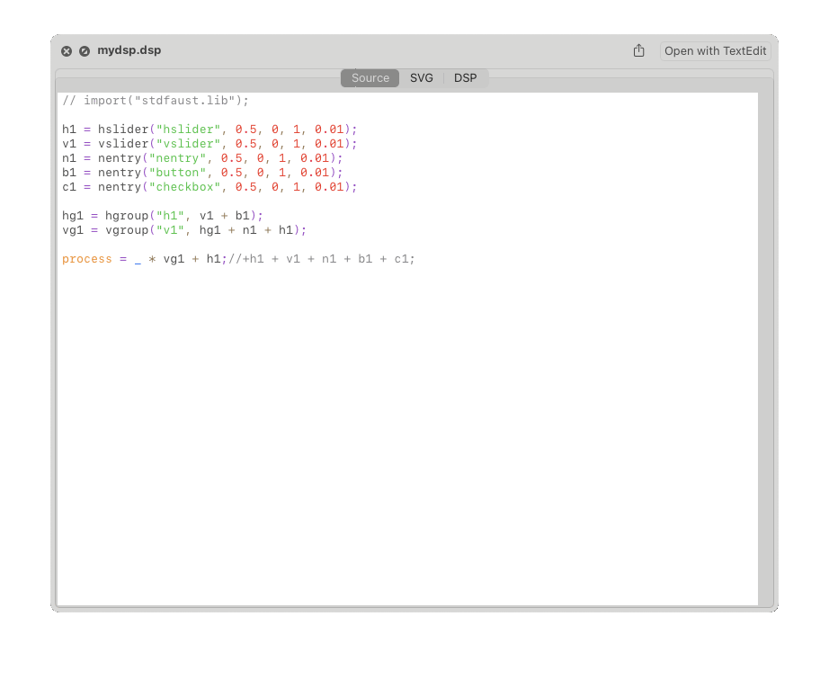

# QLFAUST

QuickLook plugin for FAUST Programming Language

## Features
- Syntax highlighting for **FAUST DSP code**.
- Supports highlighting for:
  - **Keywords**: `process`, `let`, `import`, `component`, `where`, `letrec`, etc.
  - **Data types**: `int`, `float`.
  - **Strings**: Strings enclosed in double quotes.
  - **Numbers**: Integer and floating-point numbers.
  - **Faust Composition Operators**: `:<`, `:>`, `~`, `:`
  - **Mathematical operators**: `+`, `-`, `*`, `/`, etc.
  - **Comments**: Both line (`//`) and block (`/* */`) comments.
- **Monospaced font** for easy reading of Faust code.
- Distinct color coding for each type of code element (e.g., keywords, strings, operators, comments).
- SVG Display
- DSP Preview

Current version: 0.0.3

macOS 12+

## ROADMAP
- [ ] Add line numbering to the preview.
- [ ] Refactor to support custom themes for syntax highlighting.
- [ ] Improve performance when handling large Faust files.
- [ ] Automated build with libfaust binary
- [ ] Support & embed faust libraries - currently the import() calls are not working

## Build

Please note that this repository is missing 'libfaustllvm.a'
- download current version for your platform (or multiple with lipo) and put in Faust-X.XX.X/lib folder

---
FAUST Programming language:
https://github.com/grame-cncm/faust

---
license: **MIT**  
libfaust license: **LGPL 2.1**  
