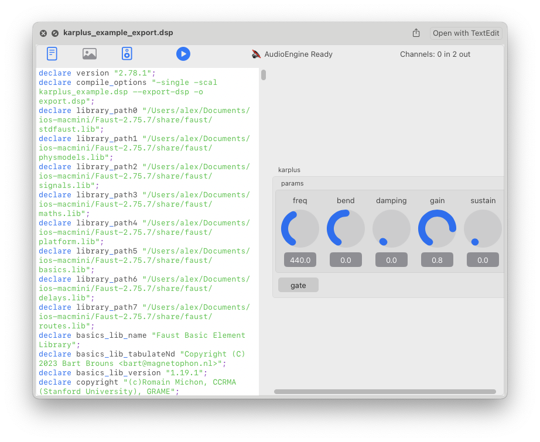

# QLFAUST

QuickLook plugin for FAUST Programming Language

## Features
- Syntax highlighting for **FAUST DSP code**.
- SVG Preview
- Audio Preview with UI

- Supports highlighting for:
  - **Keywords**: `process`, `let`, `import`, `component`, `where`, `letrec`, etc.
  - **Data types**: `int`, `float`.
  - **Strings**: Strings enclosed in double quotes.
  - **Numbers**: Integer and floating-point numbers.
  - **Faust Composition Operators**: `:<`, `:>`, `~`, `:`
  - **Mathematical operators**: `+`, `-`, `*`, `/`, etc.
  - **Comments**: Both line (`//`) and block (`/* */`) comments.
- **Monospaced font** for easy reading of Faust code.
- Distinct color coding for each type of code element (e.g., keywords, strings, operators, comments).

This repository has container app with extension and document-based test app.

Current version: 0.0.6

macOS 12+

## Build instructions

Use Xcode project; see ImportLibrary/generate_xcode_project.sh to download FAUST includes and binaries if the main project fails to build

## Roadmap
- [x] Support & embed faust libraries 
- [ ] Add line numbering to the preview.
- [ ] Refactor to support custom themes for syntax highlighting.
- [ ] Improve performance when handling large Faust files.
- [x] Automated build with libfaust binary
- [ ] Interactive SVG view - current realisation is missing links
- [ ] Improve widgets rendering/layout (FaustSwiftUI package)
- [ ] Add style metadata support to widget layout (FaustSwiftUI package) 
- [ ] Fix features of document-based app

---
FAUST Programming language:
https://github.com/grame-cncm/faust

---
license: **MIT**  
libfaust license: **LGPL 2.1**  
